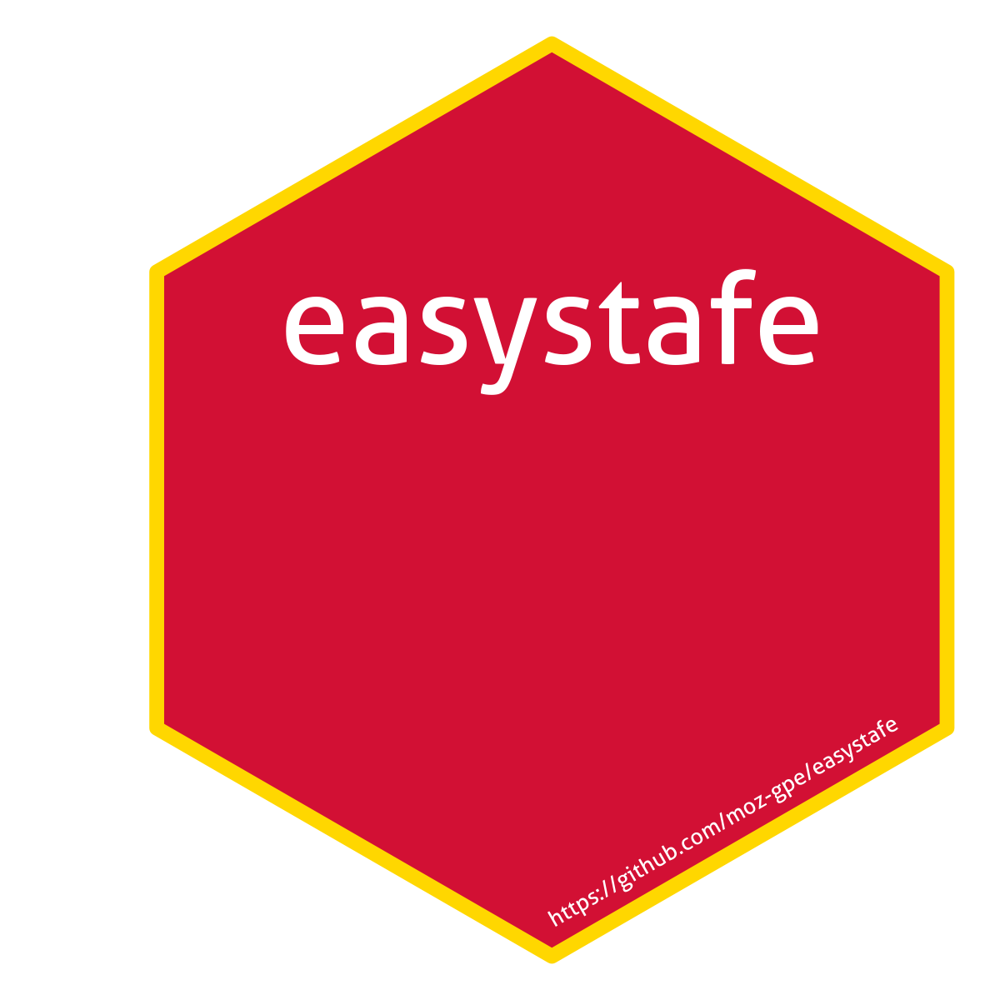

# easystafe: Ferramentas para Processamento de Extractos do e-SISTAFE

O pacote **easystafe** fornece funções para processamento, deduplicação,
extração de metadados e harmonização de extractos orçamentais
provenientes do sistema e-SISTAFE. Inclui um pipeline robusto para
preparação de dados para análise financeira, monitoria de execução e
integração com workflows baseados em R.

## Details

Este pacote encontra-se atualmente em fase **experimental**.

## Logo

## See also

Useful links:

- <https://moz-gpe.github.io/easystafe/>

- Report bugs at <https://github.com/moz-gpe/easystafe/issues>

## Author

**Maintainer**: Joe Lara <joseph.lara@giz.de>

Authors:

- Damiano Stella <damiano.stella@giz.de>
